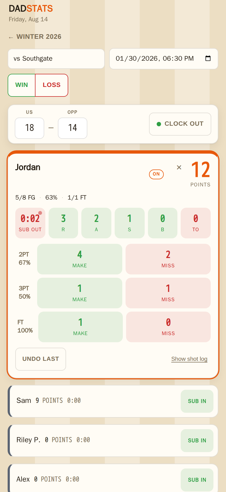
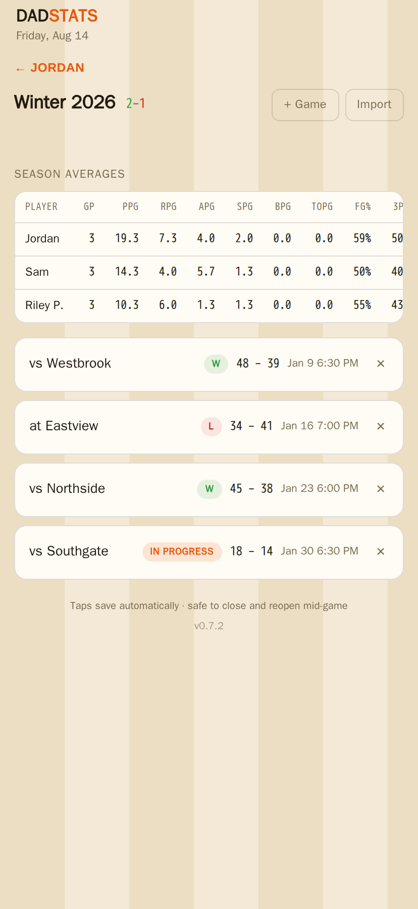
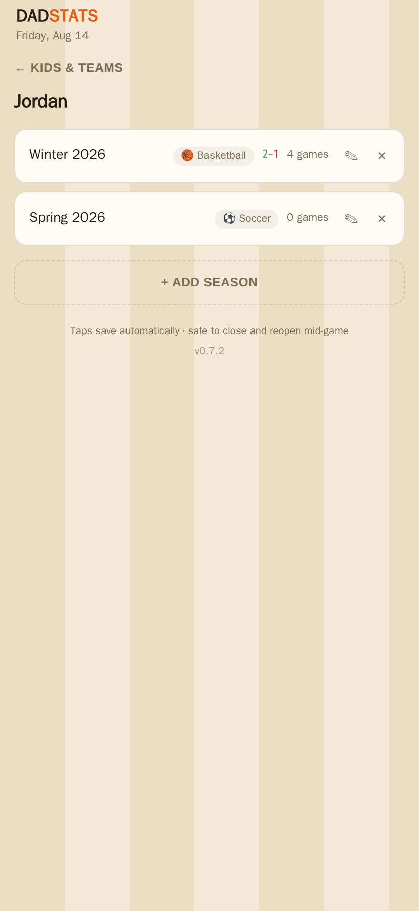
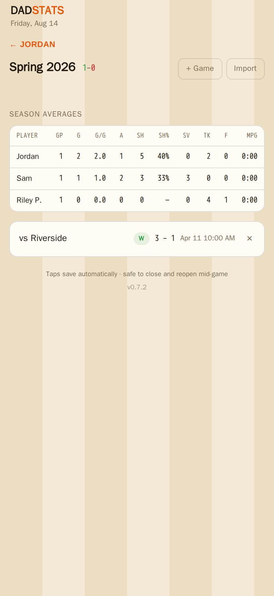
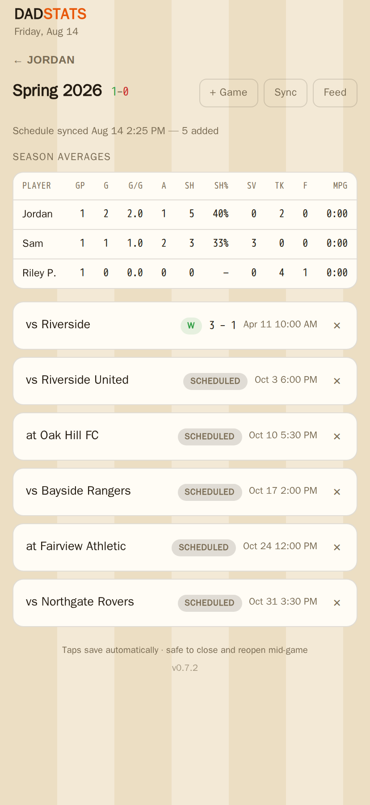
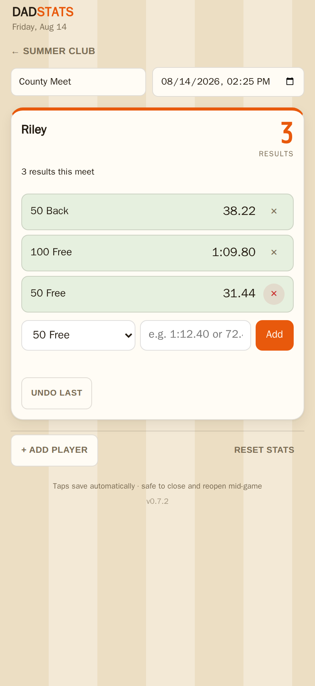
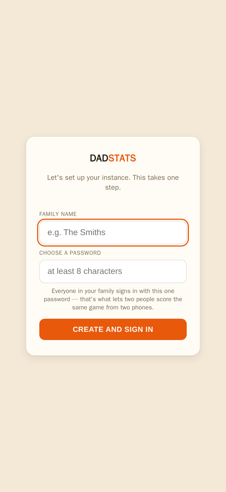
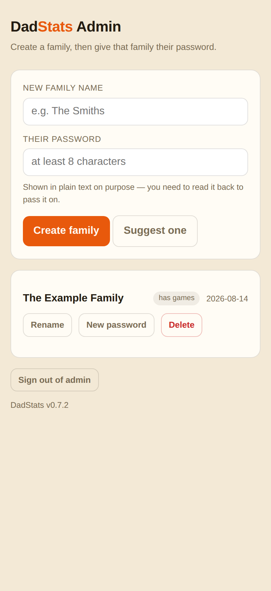
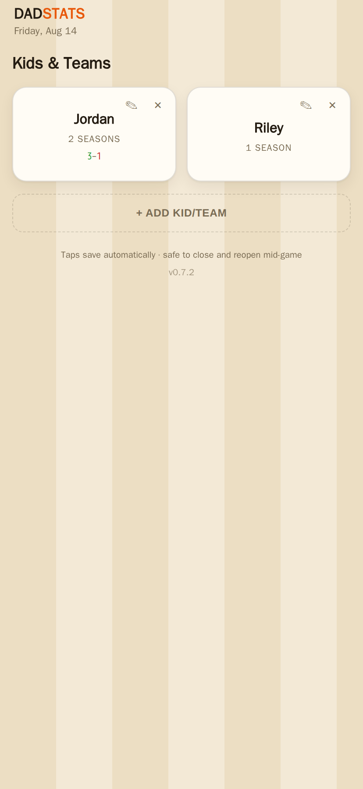

# DadStats

> **Early days — `0.x`.** Released and tested, but not yet used in anger by anyone but me.
> Expect rough edges, and please report them.

A stat tracker built for one job: standing at a gym or field, phone in hand, logging what happens
within a couple of seconds of it happening — then reviewing it later as a season.

**Eleven sports.** Tap-to-count for team sports — basketball, soccer, hockey, field hockey,
lacrosse, volleyball, baseball/softball — and typed results for individual ones: swimming, track
& field, golf, bowling.

The sport is set per *season*, so one kid can swim in the summer and play basketball in the
winter under the same name. Each season tracks its own stats: a basketball season shows PPG and
FG%, a soccer season shows goals and shot%, a swimming season shows personal bests per event.

Built for scoring from the stands, including **two parents scoring the same game from two phones**
— taps from both merge instead of one overwriting the other.

Install it to a phone's home screen and it behaves like a native app (standalone mode, screen
stays awake while open).

**Free and self-hosted, forever.** If it saved you some effort, you can
[buy me a coffee](https://ko-fi.com/raymondoooo).

---

## What it looks like

| Scoring a live game | The season |
|---|---|
|  |  |
| One card for whoever's on court, with a live clock. Everyone else collapses to a one-line strip, so a full roster still fits on a phone. | Averages count finalized games only, so the game in progress never skews them. |

| One kid, two sports | Averages follow the sport |
|---|---|
|  |  |
| The sport belongs to the season, so a basketball winter and a soccer spring live under one name and one record. | Soccer shows goals and shot%, not PPG and FG% — the whole table changes with the sport. |

| A schedule, imported | Sports that measure instead of counting |
|---|---|
|  |  |
| Paste a TeamSnap or league `.ics` URL and the season fills itself in. Re-syncing updates a rescheduled game instead of duplicating it. | Swimming, track, golf and bowling record a typed result per event rather than tap-counters, and track personal bests. |

---

## Quick start

```bash
docker run -d --name dadstats -p 3211:3211 -v dadstats-data:/app/data \
  raymondoooo/dadstats
```

Open `http://localhost:3211` and pick a family name and password. That's it — you're in. No config
file, no database to provision, no logs to go fishing in.



That form only exists while the instance has no families. The moment one exists it closes
permanently and the server rejects any further attempt — otherwise it would be an open sign-up
page on whatever address you've exposed.

Adding **more** families later (if you're hosting for other people) is done at `/admin`; the admin
password is printed to the container logs on first run (`docker logs dadstats`) or set with
`-e ADMIN_PASSWORD=...`. See [Running it](#running-it) for the full config.



Each family gets its own password and sees only its own kids. The admin can create, rename,
re-password and delete families — but game data is an opaque blob to that surface, so the admin
page can't read anyone's season.

---

## Versions

Two channels. Stable is the default; nothing you do accidentally opts you into a beta.

| Tag | What it is |
|---|---|
| `latest` | Newest stable. Fine for most people. |
| `0.7`, `0` | Newest stable within that minor / major. Pin here if you want updates but no surprises. |
| `0.7.2` | Exactly that build, forever. |
| `beta` | Newest **prerelease**. Opt-in only — never served to `latest` or any stable pin. |

Betas exist so new features get real use before they reach people mid-season. They pass the same
full test suite as a stable release; what they haven't had is weeks of somebody's actual games.

```bash
# stable (default)
docker run -d -p 3211:3211 -v dadstats-data:/app/data raymondoooo/dadstats

# beta — please report what breaks
docker run -d -p 3211:3211 -v dadstats-beta:/app/data raymondoooo/dadstats:beta
```

**Use a separate volume for a beta.** Upgrades migrate your database and are one-way: an older
image refuses to start against a newer schema rather than risk corrupting it. Trying a beta on
your real data means you can't easily go back.

Versions before `0.2.2` are not available — they had a bug that broke bind-mounted volumes.

**`0.4.0` changes the port inside the container from 3108 to 3211**, so the host and container
sides match in the docs and a `docker ps` line reads the same on both halves. If you're upgrading
from `0.3.x` or earlier and want to keep your existing mapping, either update it to `-p 3211:3211`
or pin the old port back:

```bash
docker run -d -p 3108:3108 -e PORT=3108 -v dadstats-data:/app/data raymondoooo/dadstats
```

---

## The stack

| Piece | What it is |
|---|---|
| `public/index.html` | The entire client — one self-contained file. No build step, no framework, no dependencies. |
| `server/` | Express: static hosting, family auth, and a single state endpoint. |
| SQLite (`better-sqlite3`) | One JSON blob per family, in a single file on a mounted volume. The server does not understand the app's data model. |

**Why one file and one blob:** the client owns all logic and reads/writes its whole state at
once. The server never parses a game, a season, or a stat — it stores and returns opaque JSON.
That means data model changes ship as a client edit alone; no migrations, no API versioning.
The tradeoff is that the server can't do per-record queries or conflict resolution, so merging
concurrent edits is the client's job (see [Sync](#sync-the-hard-part)).

---

## Navigation

Four screens, drilling down. The current screen is persisted, so closing the app mid-game and
reopening drops you back exactly where you were.

```
Kids & Teams  →  Seasons  →  Games  →  Tracker
  (profiles)                            (live)
```

- **Kids & Teams** — one tile per kid or team, showing season count and overall W–L record.
- **Seasons** — that profile's seasons with per-season record and game count.
- **Games** — that season's games sorted soonest-first, plus a Season Averages table.
- **Tracker** — one game: scoreboard, clock, and a card per player.



Every level supports rename and delete, including deleting the last one — an account with no kids,
or a kid with no seasons, shows an empty prompt rather than being prevented.

## Game lifecycle

Games are created ahead of time and filled in later, so you can stage a whole season's schedule
in one sitting:

```
Scheduled  ──(any stat logged)──▶  In Progress  ──(Win / Loss)──▶  Final (W or L)
    ▲                                                                   │
    └───────────────────── reopen and edit freely ──────────────────────┘
```

Nothing locks. A finalized game reopens for full editing and can be re-finalized or flipped
W↔L. **Season Averages only count finalized games**, so a game in progress never skews them.

Two more rules keep the averages honest:

- **GP counts appearances, not roster spots.** A player card only counts as a game played if that
  kid has a logged stat, banked floor time, or is on court. Staging a roster before tip-off, or
  adding a kid who never gets in, no longer inflates GP and deflates every per-game average.
- **GP counts distinct games, not cards.** Two devices adding the same kid to one game produce two
  cards (rosters merge by id, which can't tell them apart) — their stats add together, but the game
  counts once.

### Importing a schedule

Staging a season by hand is fine for a dozen games; a league's TeamSnap or website calendar feed
is usually faster. On the season screen, **+ Import from calendar feed** takes an `.ics` URL and
turns each event into a game — its name from the event title, its date/time from `DTSTART`.

What it does and doesn't do:

- **Re-syncing is safe.** Events are matched by their calendar UID, so syncing the same feed again
  updates existing games' names/dates (a reschedule shows up) rather than duplicating them.
- **Never touches a scored game's players, log, score, or result.** Only the name and date/time
  refresh from the feed; everything you've recorded stays exactly as recorded.
- **Never deletes anything.** An event that disappears from the feed (the league cancelled it)
  just stops being synced — the game it created stays until you delete it yourself. This also
  means a game you delete on purpose won't come back on the next sync: the season remembers every
  UID it has ever imported (`icsSeenUids`), independently of whether a game for it still exists.
- **No recurring-event expansion.** A feed that uses one `RRULE` instead of listing each game as
  its own event yields a single game at that rule's own start time — every real league schedule
  we've seen lists games individually, so this hasn't been a practical problem.
- **No timezone database.** A UTC (`...Z`) timestamp is read correctly; anything else — floating
  time or a named `TZID` — is read as local time in whoever's browser is importing it. Right for
  floating time by spec, an approximation for a `TZID`, and usually correct since the feed and the
  family are normally in the same timezone. Worth a glance after the first import.

The fetch happens server-side (`GET /api/ical-proxy`, see `server/icalProxy.js`), not from the
browser — calendar hosts don't send CORS headers permitting a cross-origin `fetch()`, so there's
no way to do this client-side. That makes the endpoint "authenticated user asks the server to
fetch a URL of their choosing," which is SSRF (CWE-918) if left unguarded: it could otherwise be
pointed at anything reachable from the container but not from a browser — router admin pages,
other services on the LAN, cloud metadata endpoints. The proxy resolves the hostname once, rejects
private/loopback/link-local addresses, and connects to that literal resolved address rather than
the hostname again — closing the DNS-rebinding gap where a second lookup could return something
different from the one that passed the check. Redirects are re-validated the same way, one hop at
a time, since a URL that passes the check can still redirect somewhere that wouldn't.

## Tracking a game

Each player card carries:

- **A headline number** — derived, never entered. Points in basketball (FT×1 + 2PT×2 + 3PT×3),
  goals in soccer, points as goals+assists in hockey and lacrosse, kills in volleyball, hits in
  baseball.
- **Tally buttons** — one tap each. R/A/S/B/TO in basketball, A/SV/TK/F in soccer, and so on.
- **Make/miss rows** — with a running percentage, labelled for the sport: Make/Miss for a
  basketball shot, Goal/Miss for soccer, Kill/Error for a volleyball attack.
- **Sub In/Out** with a live clock — only for sports that track floor time.
- **Undo last** and an expandable log.

**On-court players sort to the top** and get an accent ring plus an `ON` pill. Once anyone is on
the floor, everyone else collapses to a one-line bench strip (name, points, minutes, Sub In) —
tap the strip to expand it, or the `−` to re-collapse. If nobody has ever been subbed in, nothing
collapses, so tracking a single opposing player without using subs works unchanged.

**Two independent clocks:**

- **Sub In/Out** is per player — who is on the floor right now.
- **Clock In/Out** (in the sticky bar) is game-wide, for stoppages. It freezes every on-court
  player's timer together without changing who is subbed in.

Forgetting to sub out before finalizing is handled: `finalizeGame` banks any running time first.

---

## Data model

State is one nested object per family:

```
state
├── provisional?          true only for a placeholder state this device invented (see below)
├── nav                   { screen, profileId, gameId }  — persisted so reopening resumes
└── profiles[]            a kid or a team
    ├── name, id
    ├── activeSeasonId
    └── seasons[]
        ├── sport            which stat schema this season uses (see Sports)
        ├── icsUrl, icsLastSyncedAt, icsSeenUids[]   calendar feed import (see below)
        └── games[]
            ├── name, createdAt (the game's date/time — editable), updatedAt
            ├── finalized, result ('W' | 'L' | null)
            ├── teamScore, oppScore, clockRunning
            ├── icsUid?          set only on a game created by a feed import
            └── players[]
                ├── id, name, tone, removed, metaUpdatedAt
                ├── onCourt, subInAt, timeMs
                ├── the season's sport's stat keys                       ← derived, see below
                └── log[]  { id, ts, key, result, label, removed }
```

Three rules matter more than the rest:

1. **Stat counters are derived, never authoritative.** Every tap appends a uniquely-id'd entry to
   `log[]`, and the counters are recomputed from it (`recomputeFromLog`). Undo tombstones the
   entry (`removed: true`) instead of popping it.
2. **Deletes are tombstones, not splices.** Removed players, undone log entries, deleted seasons
   and deleted profiles all stay in their array flagged `removed`. A merge can't tell "never
   existed here" from "was deleted here", so anything spliced out is simply resurrected by the next
   sync from another device. Everything user-facing reads through `activePlayers`,
   `activeLogEntries`, `activeSeasons` and `activeProfiles`, which filter the tombstones out.
3. **A player's identity across games is their name.** There is no season-level roster object —
   every game holds its own independent cards, and `player.id` is unique per card, not per kid.
   Season Averages therefore group by trimmed, lowercased name. The consequence: renaming a kid in
   one game used to leave every other game (and the averages) on the old name, so committing a
   rename now offers to fan it out across the season (`renameTargetsInSeason`). It asks first
   rather than applying silently, because unnamed kids in different games can legitimately share a
   placeholder like "Player 2", and it skips any game where the new name is already taken by
   someone else. Renames stay within the season — a name can belong to a different kid next year.

---

## Sports

Two shapes, both defined in one `SPORTS` object in `public/index.html`.

**Tally sports** (basketball, soccer, hockey, field hockey, lacrosse, volleyball,
baseball/softball) count taps: every stat is a button, and totals are derived from the event log.

**Measurement sports** (swimming, track & field, golf, bowling) record a typed value per event —
a time, a distance, a score. There are no counters; the season view is personal bests per event,
with the best flagged when the most recent attempt *is* the best. Times are parsed forgivingly:
`1:12.40`, `72.4` and `1.12.40` all work, because phone keyboards make colons awkward.

Golf records a round total and bowling a game score. Per-hole golf against par, and
frame-by-frame bowling where a strike's value depends on the next two balls, are genuinely
different models and aren't attempted.

Every sport-specific detail lives in one `SPORTS` object in `public/index.html`: which tally
buttons exist, which make/miss pairs exist and what their faces say, what the card's headline
number is, which columns the Season Averages table shows, and whether the sport tracks time on
the field at all. Nothing outside that object hardcodes a stat name, so adding a sport is adding
an entry.

**The sport belongs to the season, not the kid.** A season's sport is chosen when it's created
and can't be changed afterwards — the games under it are scored with that schema, and changing
it would leave every existing card holding counters the new schema doesn't recognise. A kid who
plays two sports has two seasons.

Seasons created before multi-sport, or arriving from a device running older code, are treated as
basketball.

Measurement mode exists precisely because the tally model didn't stretch. Tallies assume *a game,
with players, accumulating counters over time* — fine for invasion sports and, near enough,
baseball, but wrong for a swimmer, where the whole result is one number per event. Adding
swimming as a tally sport would have produced a dropdown entry that was useless at the poolside,
so it got a second shape instead of a bad fit.

The limits that remain are the ones noted above: golf is a round total rather than per-hole
against par, and bowling is a game score rather than frame-by-frame scoring that carries
forward. Both are real models this doesn't attempt.

---

## Sync (the hard part)

localStorage is an instant, offline-capable cache; the server is the shared source of truth.
`save()` writes both — local synchronously, server fire-and-forget, so tapping never blocks on
the network.

The client re-merges with the server on login, on every return to the foreground, and every 20
seconds while visible. Because a merge can therefore land in the middle of live scoring, it has
to be non-destructive at every level:

| Level | Rule |
|---|---|
| Profiles | Unioned by case-insensitive name. |
| Seasons | Unioned by id. |
| Games | Missing on either side → added. Present on both → whole-game fields (name, date, score, W/L) from the newer `updatedAt`. |
| Players | Merged individually by id, **not** taken wholesale from the winning game. |
| Player fields | Name / on-court / minutes: last-writer-wins per player via `metaUpdatedAt`. |
| Stat log | Unioned by entry id; `removed` always wins over not-removed. |

The payoff: two people can score the same live game from two phones and get the union of both
their taps, rather than whichever device saved last.

### Clock skew

Two phones can disagree by tens of seconds, which would corrupt both the live minute timers and
the `updatedAt`/`metaUpdatedAt` comparisons that decide merges. `GET /api/state` returns
`serverNow`, and the client keeps a `clockOffset` from it. **Use `now()` / `nowIso()` — not
`Date.now()` — for any timestamp that a different device might compare against.** Plain
`Date.now()` is fine for values only ever compared to themselves (`uid()` entropy, a game's
display `createdAt`).

### The `provisional` flag

A device booting with an empty cache calls `defaultState()`. That used to fabricate a placeholder
profile containing a fresh "Season 1", whose id matched nothing on the server — so merging it in
permanently added an empty season to the shared account **for every new phone or browser that ever
signed in**. They accumulated forever and synced to everyone.

`defaultState()` now marks itself `provisional: true`, `mergeStates` discards a provisional local
wholesale in favour of the server, and `save()` clears the flag the moment the state becomes
real. A genuinely new empty season created by the user still syncs normally.

`defaultState()` is also empty now — no profile, no season — so a fresh account opens on an
empty-state prompt rather than a fictional kid playing a sport nobody chose. That change is about
first-run UX, but it makes this flag less load-bearing as a side effect: there is no longer
anything in a provisional state that *could* pollute an account if the flag were ever lost.

The flag still earns its place, because an empty local state is otherwise ambiguous — "this device
hasn't synced yet" and "the user deleted everything" look identical, and only the first should
defer wholesale to the server. (Tombstones make the *deleted* case self-describing, since the
removed profiles are still in the array; `provisional` is what identifies the other one.)

### Empty is a legal state, at every level

An account can have no profiles, and a profile can have no seasons. Both render an empty prompt
rather than anything fabricated.

This is worth stating because the alternative was tried and is worse. An earlier version kept the
invariant "every profile has at least one season", which meant `sanitize()` had to *re-create* a
season whenever a merge removed the last one — reachable whenever two devices each delete a
different season and "deleted wins" leaves none. That rescue then needed a deterministic id
(`seed-s-<profileId>`) so two devices arriving independently didn't mint two different seasons
that merged into a duplicate pair. Allowing empty deletes the whole problem instead of guarding
it: nothing is invented, so there is nothing to collide.

The nav has to keep up: `sanitize()` moves a device sitting on a season that another device just
deleted back to the profile screen, and off a deleted profile back home.

### Storage migrations

localStorage has been through five shapes; `load()` walks the chain newest-first and upgrades in
place:

```
v1 flat players → v2 seasons → v3 profiles → v4 stats/subs → v5 staged games (current)
```

Legacy records lacking `id` / `metaUpdatedAt` get **deterministic, position-derived** ids
(`legacy-p-<gameId>-<idx>`), so two devices migrating the same old data independently land on the
same ids instead of minting different random ones and duplicating everything on first sync.

---

## Your browser's copy

The client keeps a full copy of your account in the browser so it works with no signal and never
blocks a tap on the network. That cache is tied to the account it came from — an instance
identifier plus your family — and dropped if it doesn't match.

That matters because browser storage is keyed by address, not by installation. Rebuild an
instance at the same address, or sign a different family in on the same browser, and without that
check the old account's games would be adopted and uploaded into the new one.

---

## Auth

Two roles, deliberately small:

| Role | Gets in with | Can do |
|---|---|---|
| **Admin** | `ADMIN_PASSWORD`, at `/admin` | Create, rename, re-password and delete families. Never sees game data. |
| **Family** | the password their admin gave them | Their own kids, seasons and games. Nothing else. |

**The first visit sets itself up.** A brand new instance shows a one-step setup form instead of
a sign-in prompt: pick a family name and password and you're straight into the app. That path
closes permanently the moment a family exists — it is a one-time door, not self-signup.

**After that, you create the accounts.** Sign in at `/admin`, add a family ("The Smiths"), and
hand them the password — text it, email it, write it on the fridge. There's no sign-up form and
no invite email to configure, because the whole point is that you already know these people.

Within a family there are still no usernames — **the password is the whole credential**, and
that's what makes two parents scoring one game from two phones work: same password, two devices,
both signed in.

Notes on the details:

- **An unrecognised password is rejected**, not turned into a new account. (Earlier versions did
  the latter, so a typo dropped you into a confusingly empty app.)
- **Duplicate passwords are refused at creation.** Since the password *is* the identity, two
  families sharing one would land in the same account.
- Sessions are a JWT in an httpOnly cookie — 30 days for a family (it lives on a phone in a
  pocket), 12 hours for admin.
- Login is a linear `bcrypt.compare` scan across families, because bcrypt hashes are salted and
  can't be looked up by equality. Fine for a household; it does mean creating a family gets
  slower as you add them, since each new password is checked against every existing one.
- Failed logins are rate limited to 10 per IP per 15 minutes, on both the family and admin
  endpoints. **Behind a reverse proxy, set `TRUST_PROXY=1`** or every request looks like it came
  from the proxy and one person's typo locks out everyone.

---

## Running it

Single container, no external services:

```bash
docker build -t dadstats .
docker run -d --name dadstats -p 3211:3211 -v dadstats-data:/app/data dadstats
```

Every setting is optional — the command above works as-is.

| Env var | Default | What it does |
|---|---|---|
| `PORT` | `3211` | Port the app listens on, inside the container. |
| `SQLITE_PATH` | `/app/data/dadstats.db` | DB file. Keep it inside your mounted volume or data won't survive a restart. |
| `ADMIN_PASSWORD` | auto-generated | Gate for `/admin`. If unset, generated on first boot, printed to the logs, and saved to `<data dir>/.admin_password`. |
| `JWT_SECRET` | auto-generated | Generated on first boot and persisted to `<data dir>/.jwt_secret`, so sessions survive restarts with zero config. |
| `SECURE_COOKIES` | off | Set to `1` **only if browsers reach the app over HTTPS** (directly or via a TLS-terminating proxy). It marks the session cookie `Secure`, which browsers refuse to send back over plain HTTP — turning it on for an `http://` install locks you out of login with no visible error. |
| `TRUST_PROXY` | off | Set to `1` behind a reverse proxy so the login rate limit sees real client IPs instead of the proxy's. |
| `TZ` | container default | Timezone for server-side timestamps. |

### Putting it on the internet

Anything past your own LAN should sit behind a reverse proxy that terminates TLS (Caddy, nginx,
Traefik), with `SECURE_COOKIES=1` and `TRUST_PROXY=1` set. Family passwords are the only gate on
a season's worth of kids' names and schedules — don't serve them over plain HTTP across the
open internet.

`schema.sql` is applied on boot and is idempotent, so it converges both a fresh volume and an
in-place upgrade without a separate migration step.

`GET /api/health` reports DB connectivity, and the image ships a Docker `HEALTHCHECK` that uses it.

**Runs as the unprivileged `node` user.** The container starts as root only long enough to fix
ownership of the mounted data directory, then drops privileges — so named volumes and bind mounts
both work with no preparation on your side.

### Your data, and backing it up

Everything lives under one directory — the volume you mounted at `/app/data`:

```
/app/data
├── dadstats.db          the entire database: families, kids, seasons, games
├── .jwt_secret          signing key for sessions
├── .admin_password      generated admin password (absent if you set ADMIN_PASSWORD)
├── .instance_id         non-secret id identifying this install to browsers (see below)
└── backups/             automatic pre-upgrade snapshots
```

Those dotfiles are easy to miss. `rm -rf /app/data/*` leaves all four behind, and `.instance_id`
in particular is what tells a browser this is the same install it saw before — so a "wipe and
start over" that skips it hands your old cached data straight back to the new instance. Clear the
directory with `rm -rf /app/data/* /app/data/.[!.]*`, or just delete the volume.

**Stop the container before deleting anything.** Deleting the files under a running instance
doesn't reclaim them: SQLite holds the database open, so it keeps happily reading and writing a
file that no longer has a name, and `/api/health` keeps reporting `db: up` while the app serves
data you thought you'd deleted. It looks exactly like a leak and isn't one. `docker compose down`
first, then delete.

**Back up that folder and you've backed up everything.** Stop the container first for a clean
copy, or use `sqlite3 dadstats.db ".backup ..."` while it runs.

Before any schema upgrade, DadStats snapshots the database into `backups/` automatically. To roll
back, stop the container, copy a snapshot over `dadstats.db` (removing any `-wal`/`-shm`
alongside), and start the image that matches it.

**Upgrades are one-way.** The database records its schema version, and an older image will
**refuse to start** against a newer database rather than write through a schema it doesn't
understand and corrupt your season. If you roll back and see that error, either pull the newer
image again or restore a snapshot.

### Editing the client

There is no build step — `public/index.html` is served as-is. In a local dev loop, `npm run dev`
(via `--watch`) restarts the server on change; the client itself needs only a browser refresh.

### Tests

`test/` holds ten end-to-end browser checks plus four non-browser suites (see `test/README.md`).
The important one is `sync-check.js`: it drives two independent browser sessions scoring the same
game concurrently and asserts both converge on the union of the taps. **Run it after any change to
the merge code, the stat schema, or the state endpoints** — that contract fails invisibly until a
real game. `tombstone-check.js` is its counterpart for deletion: that deleting a kid or a season
survives a merge with a device that still has it.

---

## Known constraints

- **Every tap re-renders the whole card list and PUTs the entire state.** Fine at this scale — a
  season is tens of kilobytes — but it makes the app's responsiveness proportional to total state
  size, which is a sharp edge rather than a gentle one. A merge bug that quietly duplicated a
  tombstone on every sync grew one account to 2.5MB and made a phone feel like it had stopped
  responding to taps, with nothing visibly wrong on screen. `test/merge-growth-check.js` now
  guards the "state must not grow on its own" half; debouncing the PUT and patching the DOM in
  place is the fix for the rest, if it's ever needed.
- **`prompt()` / `confirm()`** are used for naming and destructive confirmations. They work, but
  they're the least polished surface in the app.
- **Profiles merge by name**, so renaming the same kid differently on two offline devices yields
  two profiles rather than a conflict. Deliberate: nothing is ever silently lost, and merging two
  visible profiles by hand is easy.
- **Deleting a kid, then adding a new one with the same name, only converges if both devices see
  the delete first.** Profiles coalesce by name, so `addProfile` treats a tombstone and a live
  profile sharing a name as the same kid *only when their ids match*; otherwise the live one wins,
  which is what lets a name be reused. A device that was offline for both the delete and the
  re-add can therefore keep its own copy under that name until it syncs.
